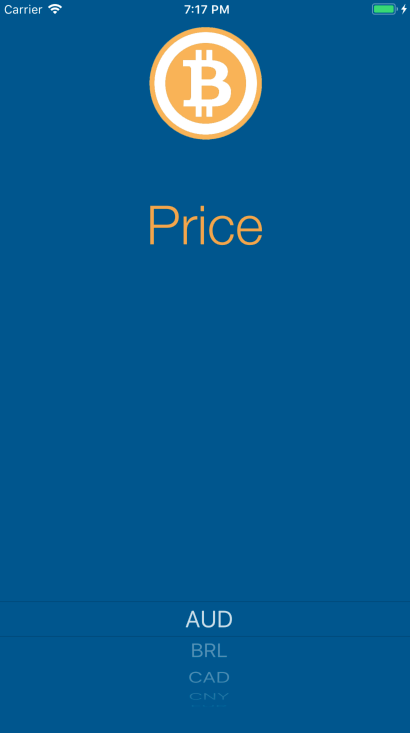
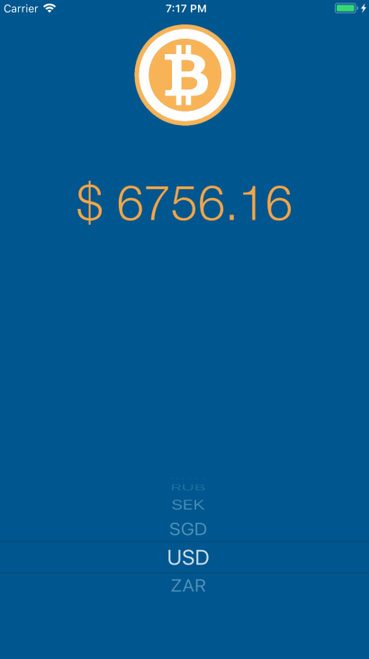

# Bitcoin_Exchange
Basic bitcoin exchange rate tracker developed using Swift 4 in Xcode 9.4.1. 
Project made to view the current, real-time exchange rate of Bitcoin in a variety of currencies including:
<li> AUD, BRL, CAD, CNY, EUR, GBP, HKD, IDR, ILS, INR, JPY, MXN, NOK, NZD, PLN, RON, RUB, SEK, SGD, USD, ZAR </li>

 

Completed as an assignment for a course utilizing introductory concepts making HTTP networking requests with Alamofire and JSON parsing data retrieved through API requests.

 

<h1>Future Enhancements:</h1>
<ul>
  <li> Thorough testing for deficiencies </li>
  <li> Improve UI Experience with real time updates of Bitcoin exchange rate </li>
  <li> Implement further resources to offer users information on exchange information </li>
  <li> Add formatting options for each currencies based on locale </li>
</ul>

 

<h1>Latest Adjustments:</h1>
<ul>
  <li> 07/07/2018 - Adjusted color scheme </li>
  <li> 07/07/2018 - Implemented initialization customizations to UIPickerView upon launch </li>
</ul>

 

  
  

